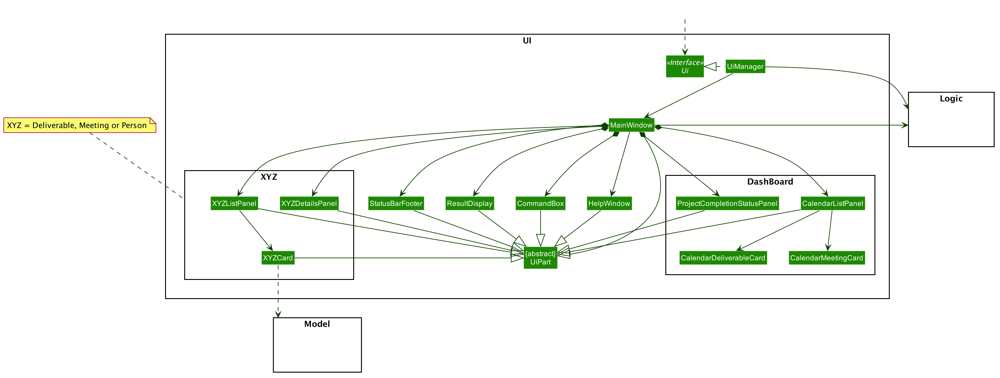
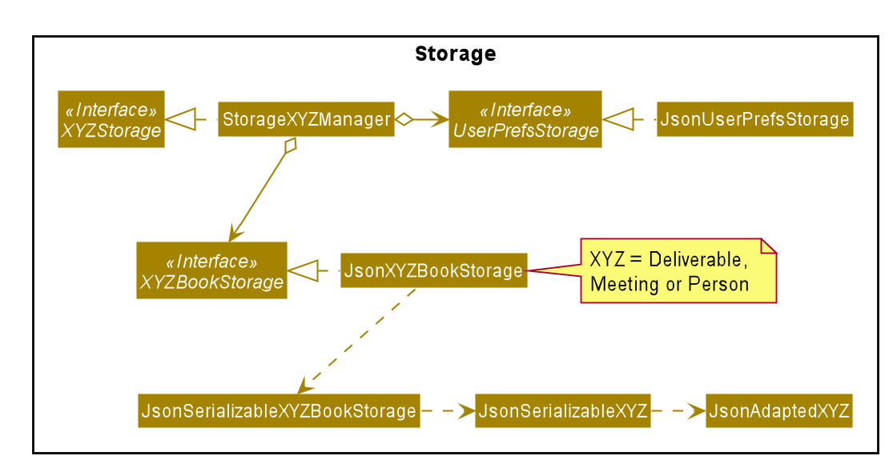
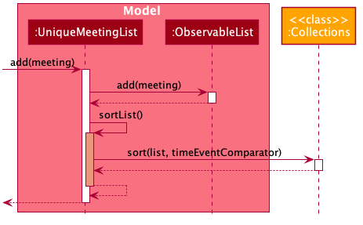
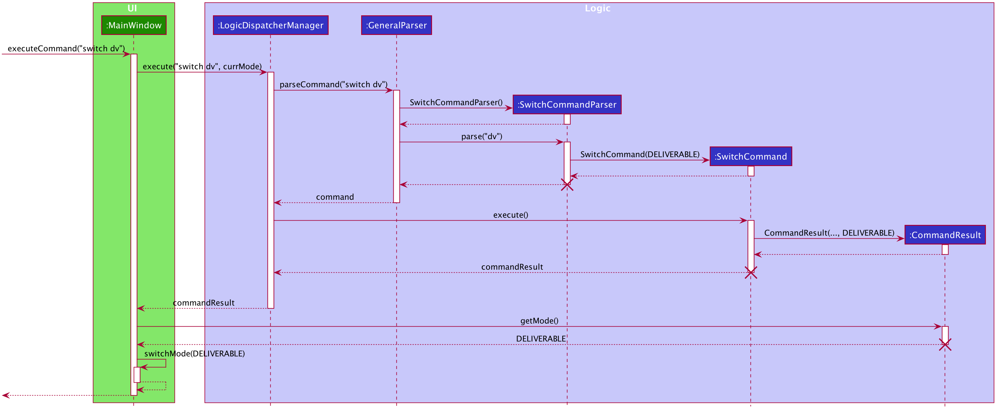
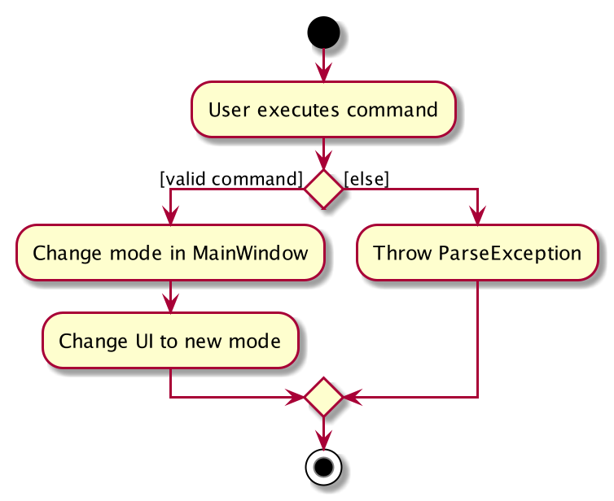
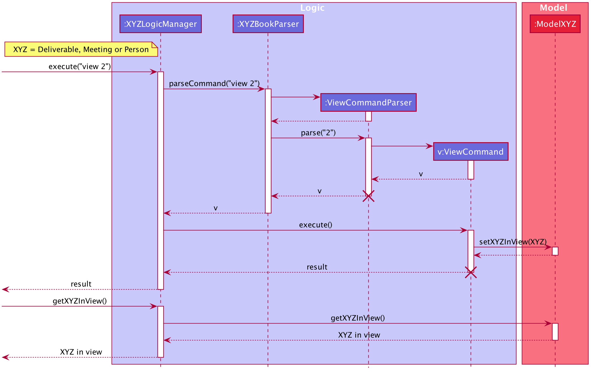
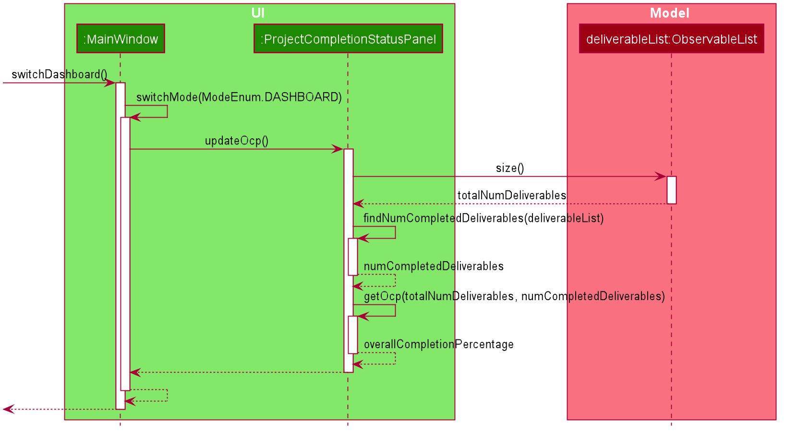

* Table of Contents
{:toc}

--------------------------------------------------------------------------------------------------------------------

## **Setting up, getting started**

Refer to the guide [_Setting up and getting started_](SettingUp.md).

--------------------------------------------------------------------------------------------------------------------

## **Design**

### Architecture

The ***Architecture Diagram*** given above explains the high-level design of the App. Given below is a quick overview of each component.

:bulb: **Tip:** The `.puml` files used to create diagrams in this document can be found in the [diagrams](https://github.com/se-edu/addressbook-level3/tree/master/docs/diagrams/) folder. Refer to the [_PlantUML Tutorial_ at se-edu/guides](https://se-education.org/guides/tutorials/plantUml.html) to learn how to create and edit diagrams.

**`Main`** has two classes called [`Main`](https://github.com/se-edu/addressbook-level3/tree/master/src/main/java/seedu/address/Main.java) and [`MainApp`](https://github.com/se-edu/addressbook-level3/tree/master/src/main/java/seedu/address/MainApp.java). It is responsible for,
* At app launch: Initializes the components in the correct sequence, and connects them up with each other.
* At shut down: Shuts down the components and invokes cleanup methods where necessary.

[**`Commons`**](#common-classes) represents a collection of classes used by multiple other components.

The rest of the App consists of four components.

* [**`UI`**](#ui-component): The UI of the App.
* [**`Logic`**](#logic-component): The command executor.
* [**`Model`**](#modelPerson-component): Holds the data of the App in memory.
* [**`Storage`**](#storagePerson-component): Reads data from, and writes data to, the hard disk.

Each of the four components,

* defines its *API* in an `interface` with the same name as the Component.
* exposes its functionality using a concrete `{Component Name}Manager` class (which implements the corresponding API `interface` mentioned in the previous point.

For example, the `Logic` component (see the class diagram given below) defines its API in the `Logic.java` interface and exposes its functionality using the `LogicManager.java` class which implements the `Logic` interface.

**How the architecture components interact with each other**

The *Sequence Diagram* below shows how the components interact with each other for the scenario where the user issues the command `delete 1`.

The sections below give more details of each component.

### UI component

**API** :
[`Ui.java`](https://github.com/se-edu/addressbook-level3/tree/master/src/main/java/seedu/address/ui/Ui.java)

The UI consists of a `MainWindow` that is made up of parts e.g.`CommandBox`, `ResultDisplay`, `PersonListPanel`, `StatusBarFooter` etc. All these, including the `MainWindow`, inherit from the abstract `UiPart` class.

The `UI` component uses JavaFx UI framework. The layout of these UI parts are defined in matching `.fxml` files that are in the `src/main/resources/view` folder. For example, the layout of the [`MainWindow`](https://github.com/se-edu/addressbook-level3/tree/master/src/main/java/seedu/address/ui/MainWindow.java) is specified in [`MainWindow.fxml`](https://github.com/se-edu/addressbook-level3/tree/master/src/main/resources/view/MainWindow.fxml)

The `UI` component,

* Executes user commands using the `Logic` component.
* Listens for changes to `Model` data so that the UI can be updated with the modified data.

### Logic component

**API** :
[`Logic.java`](https://github.com/se-edu/addressbook-level3/tree/master/src/main/java/seedu/address/logic/Logic.java)

1. `Logic` uses the `AddressBookParser` class to parse the user command.
1. This results in a `Command` object which is executed by the `LogicManager`.
1. The command execution can affect the `Model` (e.g. adding a person).
1. The result of the command execution is encapsulated as a `CommandResult` object which is passed back to the `Ui`.
1. In addition, the `CommandResult` object can also instruct the `Ui` to perform certain actions, such as displaying help to the user.

Given below is the Sequence Diagram for interactions within the `Logic` component for the `execute("delete 1")` API call.

:information_source: **Note:** The lifeline for `DeleteCommandParser` should end at the destroy marker (X) but due to a limitation of PlantUML, the lifeline reaches the end of diagram.

### Model component

**API** : [`Model.java`](https://github.com/se-edu/addressbook-level3/tree/master/src/main/java/seedu/address/modelPerson/Model.java)

The `Model`,

* stores a `UserPref` object that represents the user’s preferences.
* stores the address book data.
* exposes an unmodifiable `ObservableList<Person>` that can be 'observed' e.g. the UI can be bound to this list so that the UI automatically updates when the data in the list change.
* does not depend on any of the other three components.

:information_source: **Note:** An alternative (arguably, a more OOP) modelPerson is given below. It has a `Tag` list in the `AddressBook`, which `Person` references. This allows `AddressBook` to only require one `Tag` object per unique `Tag`, instead of each `Person` needing their own `Tag` object. 

### Storage component

**API** : [`Storage.java`](https://github.com/se-edu/addressbook-level3/tree/master/src/main/java/seedu/address/storagePerson/Storage.java)

The `Storage` component,
* can save `UserPref` objects in json format and read it back.
* can save the address book data in json format and read it back.

### Common classes

Classes used by multiple components are in the `seedu.addressbook.commons` package.

--------------------------------------------------------------------------------------------------------------------

## **Implementation**

This section describes some noteworthy details on how certain features are implemented.
### [In Progress] \[DateTime\]

#### Proposed Implementation
The implementation allows users to parse and compare unique DateTime types. 

To parse, DateTime should be in the following format: **`dd-MM-yyyy HH:mm`** 
* Single digits fields must include leading zero: `01-01-0101 01:10`.
* Valid Calendar Range: \[`01-01-0001 00:00` - `31-12-9999 23:59`\].

DateTime will throw a parsing error if
* `1-10-2020 00:00:59` Format is wrong (e.g missing or additional digit).
* `31-02-2020 00:00` Invalid range (e.g invalid leap year).

The following is an example of how DateTime can be implemented into the model

* DateTime is a class that can be used by all models.
* From, To and Deadline are fields which extend from DateTime.

DateTime can be used to compare with other DateTime objects:
* Enable deliverables to be sorted based on which one is due the earliest.
* DateTime can be used to identify time clashes between different meetings.

#### Design consideration:
* **Alternative 1 (current choice):** Throws error when invalid range is 
given for dates
  * E.g `29-02-2019` or `31-11-2020`.
  * Pros: Notifies user he has made a mistake.
  * Cons: Costs time to re-type the entire command.
  
* **Alternative 2:** Command knows how to resolve overflow of dates. 
    * E.g `29-02-2019` will be resolved automatically to `28-02-2019` the `MAX number of days of the month`.
    * Pros: Saves time for the user if he had intended to select the last day of the month.
    * Cons: The date specified may not be the intended input.

### \[Proposed\] Autosort feature

#### Proposed Implementation

Autosort allows users to view `Meeting`s, `Deliverable`s, and `Contact`s in a logical manner. Specifically, Autosort
automatically sorts the abovementioned components by the following attributes: 

* `Meeting`   - `From`'s `LocalDateTime` value in chronological order 
* `Deadline`  - `Deadline`'s `LocalDateTime` value in chronological order 
* `Contact`   - `Title`'s `String` value in alphabetical order 

Autosort is faciliated by custom objects that implements `Comparator`.

The following sequence diagram shows how a list is autosorted upon an addition of a new element.

#### Design consideration:

##### Aspect: How autosorting executes

* **Alternative 1 (current choice):** Sorts a list upon an addition or update of an element.
    * Pros: Error-free and easy to implement.
    * Cons: Relatively high time complexity i.e. O(nlogn).
* **Alternative 2:** Searches the correct index in the list to insert an element upon addition or update.
    * Pros: Relatively low time complexity i.e. O(logn).
    * Cons: Prone to error and difficult to implement.

### Switch Mode feature

Productiv can be in any one of these modes: dashboard, deliverable, meeting and contact mode.
Based on the current mode, user input is passed to the corresponding `LogicManager`,
e.g. if the user is in deliverable mode, user input is passed to `LogicDeliverableManager`.

#### Implementation

The user input is handled and retrieved by the `MainWindow` and then passed to `LogicModeManager`.
`LogicModeManager` will call `ModeParser`, which will create a `SwitchCommandParser`.
`ModeParser` calls on `SwitchCommandParser` to parse the arguments in the user input.
`SwitchCommandParser` will parse the arguments and return a `SwitchCommand`.
This `SwitchCommand` is passed back `LogicModeManager`.
`LogicModeManager` will then call the execute method of `SwitchCommand` which returns a `CommandResult` containing the mode that the app should switch to.
This `CommandResult` is passed back `MainWindow`.
Then, `MainWindow` will then call the `getMode()` method of `CommandResult` to gets the new mode to switch to.
Based on the mode, `MainWindow` will update its own attribute `mode`.
`MainWindow` will then update the UI via `switchMode(mode)` to only show information related to the new mode.

For the command, a `SwitchCommandParser` is implemented to parse the input into a mode.
Invalid arguments (any argument other than `dv`, `db`, `m` and `c`) are also handled properly, with suitable error messages being displayed to the user.

Given below is a sequence diagram to show how the switch mode mechanism behaves.

Given below is an activity diagram to show how the switch mode operation works.

#### Design consideration:

##### Aspect: How Switch commands should be implemented

* **Alternative 1 (current choice):** Shortened user commands: `switch` `db`, `dv`, `m` or `c`.
  * Pros: More convenient and faster to type shorter user commands.
  * Cons: More difficult for users to remember short forms.

* **Alternative 2 (original implementation):** Longer user commands: `switch` `dashboard`, `deliverable`, `meeting` or `contact`.
  * Pros: Clearer as commands correspond to the naming of tabs on the navigation bar.
  * Cons: Takes longer to type longer user commands.

##### Aspect: Where mode is stored

* **Alternative 1 (current choice):** Store mode in `MainWindow`.
  * Pros: Easy to implement.
  * Cons: May violate Single Responsibility Principle.

* **Alternative 2:** Store mode in a `LogicModeManager`.
  * Pros: Adheres to the Single Responsibility Principle better.
  * Cons: `LogicModeManager` would need to have references to the other logic managers. 
  It should not be the responsibility of `LogicModeManager` to pass the user input to the relevant `LogicManager`.

### \[Proposed\] View feature

#### Proposed Implementation

The view feature allows users to view the details of a specific `Meeting`, `Deliverable` or `Contact` on the right
panel of the display window.

The proposed view mechanism is facilitated by implementing the following operations:

* `ModelDeliverable#setDeliverableInView()` — Changes the `Deliverable` to be displayed
* `ModelPerson#setContactInView()` — Changes the `Contact` to be displayed
* `ModelMeeting#setMeetingInView()` — Changes the `Meeting` to be displayed

Given below is an example usage scenario of how viewing a deliverable works.

Step 1. The user executes `view 2` command to view the details of the second deliverable in the list of deliverables. The view command calls `ModelDeliverable#setDeliverableInView()` which updates the deliverable currently in view in the `ModelDeliverable`. This newly updated deliverable is then fetched and displayed to the user on the right panel.

The following sequence diagram shows how the view operation works:

#### Design consideration:

##### Aspect: How view executes

* **Alternative 1 (current choice):** Stores the item in view inside the respective model.
  * Pros: Ensures persistence as it can be referred to repeatedly.
  * Cons: Requires another operation to fetch the item in view to be displayed.

* **Alternative 2:** Passes the item in view inside the Command Result to the UI component
  * Pros: Does not require an additional operation to fetch the item in view.
  * Cons: Inappropriate use of Command Result whose primary objective is to pass feedback to the user.

### \[Proposed\] Overall Completion Percentage feature

#### Proposed Implementation

The Overall Completion Percentage (OCP) feature is to be implemented in the Dashboard page (coming soon) of *Productiv*.
This feature allows users to have a quick overview of the progress of their product's development. OCP is given by the 
formula*:

**_OCP (%) = Number of Completed Deliverables / Total Number of Deliverables × 100_**

\* If no deliverables are present, OCP will be set to **0%**.

The OCP will only be updated upon successful execution of the following (simplified) commands:
* AddCommand, i.e. *add(deliverable)*
* DoneCommand, i.e. *done(deliverable)*
* DeleteCommand, i.e. *delete(deliverable)*

The following proposed sequence diagram shows how the updating of the OCP would be implemented:

#### Design consideration:

##### Aspect: How updating of OCP executes

* **Alternative 1 (current choice):** Store the deliverable counters within `LogicDeliverableManager`.
    * Pros: Adheres to Single Responsibility Principle.
    * Cons: May require additional interfaces/methods to retrieve the required values for OCP computation.
* **Alternative 2:** Store the deliverable counters as global variables.
    * Pros: Directly accesses the required values for OCP computation.
    * Cons: May violate Single Responsibility Principle.

--------------------------------------------------------------------------------------------------------------------

## **Documentation, logging, testing, configuration, dev-ops**

* [Documentation guide](Documentation.md)
* [Testing guide](Testing.md)
* [Logging guide](Logging.md)
* [Configuration guide](Configuration.md)
* [DevOps guide](DevOps.md)

--------------------------------------------------------------------------------------------------------------------

## **Appendix A: Product Scope**

**Target user profile**:

* has a need to manage a significant number of contacts
* has a need to manage a meeting schedule
* has a need to oversee the development of a product
* prefers to have product-related information in a single application
* prefer desktop apps over other types of apps
* can type fast
* prefers typing to mouse interactions
* is reasonably comfortable using CLI apps

**Value proposition**: 
* consolidates product-related information such as deliverables, meetings and contacts into one place
* manage their product’s development more comprehensively and conveniently than a typical mouse/GUI driven app

## **Appendix B: User Stories**

| No | EPIC                                                                                                                                        | 
|----|---------------------------------------------------------------------------------------------------------------------------------------------|
|A   | As a Product Manager, I can track my product’s development so that I can work better towards production deadlines.                          |
|B   | As a Product Manager, I can manage my stakeholder/dev team contacts.                                                                        |
|C   | As a Product Manager, I can organise my meetings with stakeholders.                                                                         |
|D   | As an inexperienced or forgetful Product Manager, I can refer to a user guide as I’m using the app so that I am able to use it as intended. |
|E   | As a bridge between Dev Team and Stakeholders, I can communicate better.                                                                    |

Priorities: 
* `* * *` - High (must have)
* `* *` - Medium (nice to have)
* `*` - Low (unlikely to have) 

| Priority | As a Product Manager…​                | I want to …​                                                             | So that I can…​                 |
| -------- | ---------------------------------------- | --------------------------------------------------------------------------- | ---------------------------------- |
| **EPIC A** |
| `* * *`  | Product Manager                          | add deliverables                                                            | keep track of them                 |
| `* * *`  | Product Manager                          | mark deliverables as completed                                              | refer back to them when needed     |
| `* * *`  | Product Manager                          | delete deliverables that are no longer relevant                             | focus on current deliverables      |
| `* *`    | Product Manager                          | change the description of the deliverables                                  | keep them up to date               |
| `* *`    | Product Manager                          | package deliverables into different milestones                              | retrieve the relevant deliverables easily |
| `* *`    | Product Manager                          | easily know who and how to contact the person-in-charge                     | contact the person when the progress of a deliverable is behind schedule |
| `* *`    | Product Manager                          | flag problematic deliverables in the app                                    | know that these tasks require further attention |
| `* *`    | Product Manager                          | find a deliverable easily                                                   |                                    |
| `* *`    | Product Manager                          | sort my deliverables by deadline                                            |                                    |
| **EPIC B** |
| `* * *`  | Product Manager                          | add contacts                                                                | store their details for future communication |
| `* * *`  | Product Manager                          | distinguish between the developers and the stakeholders in a project easily | remember the different roles       |
| `* * *`  | Product Manager                          | view my contacts and their relevant details                                 | remember and retrieve important information  |
| `* *  `  | Product Manager                          | edit my contacts                                                            | keep them up-to-date               |
| `* *`    | Product Manager                          | search for contacts based on a certain field of information                 | easily navigate through different groups |
| `* *`    | Product Manager                          | sort my contacts by alphabetical order                                      |                                    |
| `* *`    | Product Manager                          | view the details of my deliverables easily                                  |                                    |
| **EPIC C** |
| `* * *`  | Product Manager                          | schedule new meetings with my stakeholders                                  | keep track of them                 |
| `* * *`  | Product Manager                          | delete scheduled meetings with my stakeholders                              | remove outdated or cancelled meetings |
| `* *`    | Product Manager                          | edit existing meeting details with my stakeholders                          | update them accordingly            |
| `* *`    | Product Manager                          | be notified if I have conflicting meetings before adding new ones           | reschedule the meetings            |
| `* *`    | Product Manager                          | search for contacts based on a certain field of information                 | easily navigate through different groups |
| `* *`    | Product Manager                          | sort my meetings by alphabetical order                                      |                                    |
| `* *`    | Product Manager                          | view the details of my deliverables easily                                  |                                    |
| **EPIC D** |
| `* *`    | Product Manager                          | view a helpful popup                                                        | easily access the relevant instructions |
| `* *`    | Product Manager                          | receive feedback from the app                                               | know the system has registered my action correctly or not |
| `* *`    | Product Manager                          | view and easily navigate within the shortcut reference                      | locate technical solutions quickly |
| **EPIC E** |
| `* * *`  | Product Manager                          | Opening page                                                                | Enter the name of product and initialise Productiv       |
| `*`      | Product Manager                          | see a calendar view of meetings                                             | know my available slots to schedule new meetings   |
| `*`      | Product Manager                          | view the overall completion                                                 | know whether we are on track (completed deliverables/total deliverables) |

## **Appendix C: Use Cases**

(For all use cases below, the **System** is the `Productiv` and the **Actor** is the `user`, unless specified otherwise)

#### Mode

**Use case: `UC01 - Switch Mode`**

**MSS**

1. User chooses to switch the mode.
2. User enters the command to switch mode into the input box.
3. Productiv switches to the expected mode.

    Use case ends.

**Extensions**

* 2a. Produtiv detects an error in the command.
     
     * 2a1. Productiv displays an error message
     
     * 2a2. User enters the command again.
     
     * 2a3. Steps 2a1-2a2 are repeated until the command entered is correct.
     
       Use case resumes from step 3.

#### CONTACT

**Use case: `UC10 - Add a contact`**

**Precondition(s):**
* **`User is in the Contact mode`**

**MSS**

1. User adds contact.
    Use case ends.
    
**Extensions**

* 1a. Invalid input.
    
    * 1a1. Productiv shows an error message.
      
      Use case ends.

      
**Use case: `UC11 - Edit a contact`**

**Precondition(s):**
* **`User is in the Contact mode`**
* **`Contact to edit exists`**

**MSS**

1. User requests to list contacts.
1. Productiv shows list of contacts.
1. User edits a specific contact in the list.
1. Productiv edits contact details.

    Use case ends.

**Extensions**

* 2a. The list is empty.
  
  * Use case ends.
     
* 3a. The given index is invalid.
    
    * 3a1. Productiv shows an error message.
    
      Use case resumes at step 2.
      
* 4a. The given input is invalid.
    
    * 4a1 Productiv shows an error message.
      
      Use case resumes at step 2.

**Use case: `UC12 - Delete a contact`**

**Precondition(s):**
* **`User is in the Contact mode`** 
* **`Contact to delete exists`**

**Guarantee(s):** 
* **`Deleted contacts will not have its data in Productiv`**
* **`Deleted contacts cannot be retrieved back`**

**MSS**

1. User requests to list contacts.
1. Productiv shows list of contacts.
1. User requests to delete a specific contact in the list.
1. Productiv deletes the contact.
   User case ends.

    Use case ends.

**Extensions**

* 2a. The list is empty.
  
  * Use case ends.
     
* 3a. The given index is invalid.
    
    * 3a1. Productiv shows an error message.
    
      Use case resumes at step 2.
      

#### DELIVERABLES

**Use case: `UC20 - Add Deliverable`**

**Precondition(s):**
* **`User is in the Deliverable mode`** 

**MSS**

1. User chooses to add a deliverable.
1. User enters the command to add a deliverable into the input box.
1. Productiv adds the deliverable for tracking.

    Use case ends.

**Extensions**

* 2a. Produtiv detects an error in the command.
    
    * 2a1. Productiv displays an error message.
    
    * 2a2. User enters the command again.
    
    * Steps 2a1-2a2 are repeated until the command entered is correct.
      
      Use case resumes from step 3.
      
**Use case: `UC21 - Edit Deliverable`**

**Precondition(s):**
* **`User is in the Deliverable mode`** 
* **`Deliverable to edit exists`**

**MSS**

1. User chooses to edit a deliverable.
1. User enters the command to edit a deliverable into the input box.
1. Productiv edits the deliverable.
   
   Use case ends.

**Extensions**

* 2a. Produtiv detects an error in the command.
    
    * 2a1. Productiv displays an error message.
    
    * 2a2. User enters the command again.
    
    * Steps 2a1-2a2 are repeated until the command entered is correct.
      
      Use case resumes from step 3.

**Use case: `UC22 - Mark Deliverable Completed`**

**Precondition(s):**
* **`User is in the Deliverable mode`** 
* **`Deliverable to mark complete exists`**

**MSS**

1. User chooses to mark a deliverable as completed.
1. User enters the command to mark a deliverable as complete into the input box.
1. Productiv marks the deliverable as done.

    Use case ends

**Extensions**

* 2a. Produtiv detects an error in the command.
    
    * 2a1. Productiv displays an error message.
    
    * 2a2. User enters the command again.
    
    * Steps 2a1-2a2 are repeated until the command entered is correct.
      
      Use case resumes from step 3.
      
**Use case: `UC23 - Delete Deliverable`**

**Precondition(s):**
* **`User is in the Deliverable mode`** 
* **`Deliverable to delete exists`**

**Guarantee(s):** 
* **`Deleted deliverables will not have its data in Productiv`**
* **`Deleted deliverables cannot be retrieved back`**

**MSS**
1. User chooses to delete a deliverable.
1. User enters the command to delete a deliverable into the input box.
1. Productiv prompts the user to confirm deletion.
1. User accepts confirmation.
1. Productiv deletes the deliverable.
    Use case ends.

**Extensions**

* 2a. Produtiv detects an error in the command.
    
    * 2a1. Productiv displays an error message.
    
    * 2a2. User enters the command again.
    
    * Steps 2a1-2a2 are repeated until the command entered is correct.
      
      Use case resumes from step 3.
      
* 4a. User declines confirmation.

    * 4a1. Productiv cancels the deletion process.
    
      Use case ends.

#### MEETING

**Use case: `UC30 - Add a meeting`**

**Precondition(s):**
* **`User is in the meeting mode`**

**MSS**

1. User adds meeting.
    Use case ends.
    
**Extensions**

* 1a. Invalid input.
    
    * 1a1. Productiv shows an error message.
      
      Use case ends.
      
**Use case: `UC31 - Edit a meeting`**

**Precondition(s):**
* **`User is in the meeting mode`** 
* **`Meeting to edit exists`**

**MSS**

1. User requests to list meetings.
1. Productiv shows list of meetings.
1. User edits a specific meeting in the list.
1. Productiv edits meeting details.

    Use case ends.

**Extensions**

* 2a. The list is empty.
  
  * Use case ends.
     
* 3a. The given index is invalid.
    
    * 3a1. Productiv shows an error message.
    
      Use case resumes at step 2.
      
* 4a. The given input is invalid.
    
    * 4a1 Productiv shows an error message.
      
      Use case resumes at step 2.
      
**Use case: `UC32 - Delete a meeting`**

**Precondition(s):**
* **`User is in the meeting mode`** 
* **`Meeting to delete exists`**

**Guarantee(s):** 
* **`Deleted meeting will not have its data in Productiv`**
* **`Deleted meeting cannot be retrieved back`**

**MSS**

1. User requests to list meetings.
1. Productiv shows list of meetings.
1. User requests to delete a specific meeting in the list.
1. Productiv deletes the meeting.
   User case ends.

    Use case ends.

**Extensions**

* 2a. The list is empty.
  
  * Use case ends.
     
* 3a. The given index is invalid.
    
    * 3a1. Productiv shows an error message.
    
      Use case resumes at step 2.
      
*{More to be added}*
      
## **Appendix D: Non-Functional Requirements**

1. Should work on any [`mainstream OS`](#common-classes) as long as Java `11` is installed and is the default.
1. Should be able to hold up to 1000 deliverables, 1000 meetings and 1000 contacts without noticeable sluggishness in performance for typical usage.
1. A user with above average typing speed for regular English text (i.e. not code, not system admin commands) should be able to accomplish most of the tasks faster using commands than using the mouse. This excludes the Switch and Help command.
1. The user interface should look intuitive and simple to navigate. It should not look cluttered with too many panels.
1. The application should be for a single user, with its size being smaller than 100MB.

## **Appendix E: Glossary**

* **Mainstream OS**: Windows, Unix, OS-X.
* **OCP**: Overall Completion Percentage. It is a piechart showing the project's completion status, found on the left panel of the Dashboard.
* **Mode**: The state of the application that affects how each command will be executed. The app can be in dashboard, deliverable, meeting or contact mode.
* **Deliverable**: An item to be completed as part of the product development process.
* **Milestone**: A significant stage or event in the development of a product.
* **Role**: A function assumed or part played by a contact. Every contact is either a developer or stakeholder.

## **Appendix F: Instructions for Manual Testing**

Given below are instructions to test the app manually.

:information_source: **Note:** These instructions only provide a starting point for testers to work on;
testers are expected to do more *exploratory* testing. Each test case is to be executed independently of each other.

### Launch and shutdown

1. Initial launch

    1. Test case: Download the jar file and copy into an empty folder. Double-click the jar file. 
       Expected: Shows the GUI with a dashboard containing some sample data. The window size may not be optimum.

1. Saving window preferences

    1. Test case: Resize the window to an optimum size. Move the window to a different location. Close the window.
       Re-launch the app by double-clicking the jar file. 
       Expected: The most recent window size and location is retained.

       
:information_source: **Note:** The window has a minimum width and height so that the UI does not look so cramped.
       

1. Shutting down

    1. Test case: Click the window close button. 
       Expected: The app shuts down.

    1. Test case: `exit` 
       Expected: Similar to previous.

### Switching Modes

1. Switching to deliverable mode

    1. Prerequisite: You are not in deliverable mode.

    1. Test case: Click `Deliverable` on the top navigation bar. 
       Expected: Window displays list of saved deliverables.

    1. Test case: `switch dv` 
       Expected: Similar to previous.

    1. Other incorrect switch commands to try: `switch meeting`, `switch dev` 
       Expected: Status bar throws error message.

### Adding a deliverable

1. Adding Login screen

   1. Prerequisites: You are in deliverable mode. Login screen not already added. If added, delete it.

   1. Test case: `add t/Login screen m/1.0 by/12-12-2020 23:59 d/Must include username and password fields c/John Martin, Abby Li` 
      Expected: Login screen to appear in the list of deliverables and expanded in right panel.

   1. Test case: `add t/Login screen` 
      Expected: No deliverable is added. Status bar throws error message.

   1. Other incorrect add commands to try: `add`, `add Login screen`  
      Expected: Status bar throws error message.

### Saving data

1. Deliverables, meetings and contacts are saved automatically to ./data/.

   On normal usage, 3 JSON files are created / saved - `deliverablebook.json`, `meetingbook.json` and `contactbook.json`.
   All 3 files contain information stored by the user from their respective modes.

   On first starting the program, a file is only created if the user inputs a command specific to that mode.

   1. Prerequisites: Very first time using the app.

   1. Test case: Start and close the app immediately. 
      Expected: The 3 JSON files are not created.

   1. Test case: Start the app. Switch to deliverable mode. Add a deliverable. Close the app. 
      Expected: Of the 3 JSON files, only `deliverablebook.json` created.

1. Dealing with missing/corrupted data files

   1. Test case: Delete `deliverablebook.json` file. Start the app. Switch to deliverable mode. Enter `list`. Close the app. 
      Expected: `deliverablebook.json` should re-initialise a list of sample deliverables.

   1. Test case: Corrupt `deliverablebook.json` under ./data/. Add a (`-`) to a saved deliverable's milestone. 
      Expected: The app should be able to start up but show no deliverables.

      
:information_source: **Note:** To re-initialise a list of sample deliverables, execute the previous test case.
      

## **Appendix G: Effort**

| Feature     | AB3     | Productiv    |
| ----------- | ------- | ------------ |
| LoC         | ~9k     | ~20k         |
| Difficulty  | 10      | 15           |
| Effort      | 10      | 15           |

**Understanding our target user profile**

Initially, we had completely different ideas on what our target user profile is. We were confused about the differences between product owners, product managers, business analysts and project leads.

To ensure that we were all on the same page, we made sure to talk things out before starting our project. We researched on the job scope of a product manager and shared with each other our experiences of working in different organisations and what product managers do at these organisations. 

Eventually, our shared understanding on our target user profile helped us to build a cohesive product catered to product managers.

**Model**

The `Model` of Productiv is certainly more complex than that of AddressBook. In AddressBook, there was only one key entity type in play - `Person`. For Productiv, three different entity types are managed at once - `Deliverable`, `Meeting` and `Contact`.

As such, we had to restructure our entire application to accommodate these three entity types. Throughout the project, we had to rethink and refactor the structure of our code, weighing the pros and cons of each approach. This was a very painful process and also vulnerable to regressions.

Eventually, we separated the models into three different `ModelManager`s, handled by three different `LogicManager`s, adhering to the Separation of Concerns Principle. The reduced coupling decreased the dependencies between the models.

This also influenced our decision to not link the `Contacts` field in `Deliverable` and `Meeting` to data in the `Contact` model. This also provided greater flexibility to users as they could add contacts to `Deliverable`s and `Meeting`s without recording the details of the contact, e.g. a `Meeting` can involve people who are not important to record as a `Contact`.

**Ui**

The `Ui` of Productiv was almost entirely revamped from the AddressBook. 

The easiest way would have been to stick to the current `Ui` of the AddressBook i.e. have 3 lists (`DeliverableListPanel`, `MeetingListPanel` and `ContactListPanel`) on the same page. While this would have been easier to implement, it would have made Productiv look very cluttered. We chose the hard way as we believe in making the user-experience seamless and enjoyable. As such, we worked hard to have the `Ui` change according to the current mode the user is in and also create an entirely new View Panel to enhance the user experience.

The `Dashboard` was difficult to implement. In particular, the OCP was definitely not something that could be done overnight. None of us had experience with JavaFX prior to CS2103T. We did extensive research on the libraries that we could use and exhaustive checks to ensure that the OCP was synced with the rest of Productiv. Eventually, we managed to create the OCP, which vastly improved the user experience.

**Overall**

As a whole, this process was fraught with challenges. Whenever we had to face obstacles, we worked with each other to brainstorm and decide on the best solution. We made sure that everyone followed the same workflow and reviewed each other’s work to maintain the code quality of our codebase. We have learnt alot from each other, beyond just technical skills. Productiv would not have been possible without the hard work and commitment of the entire team.
