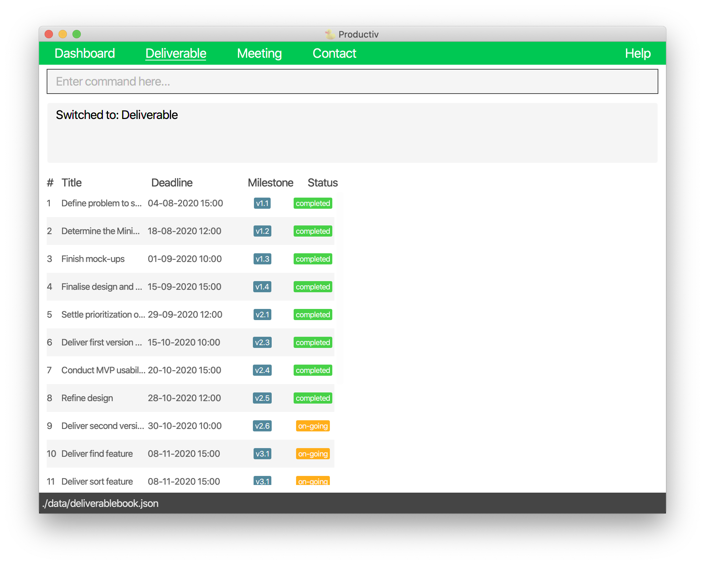
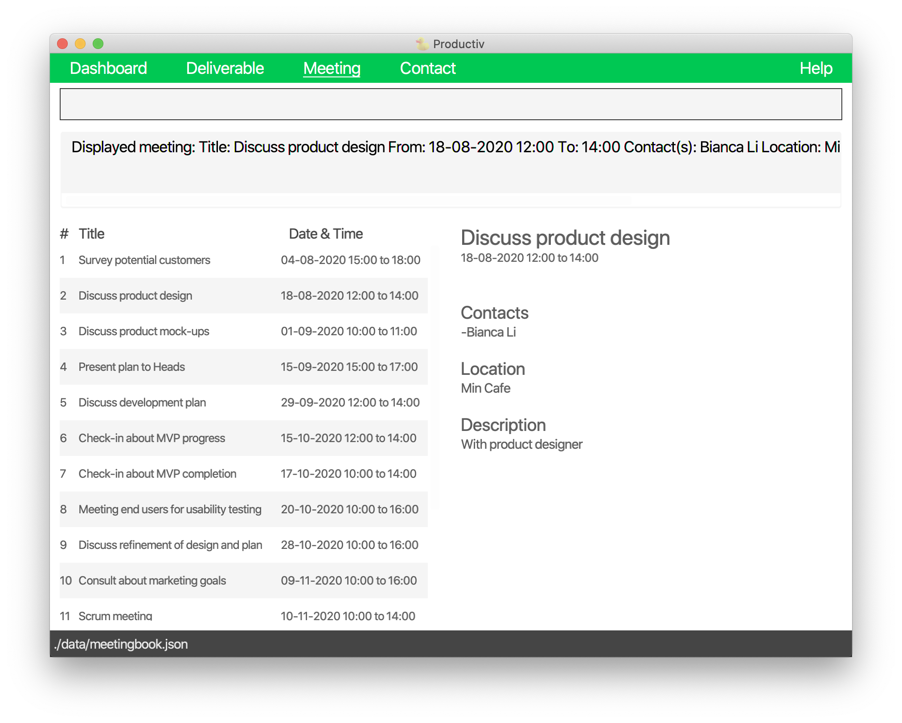
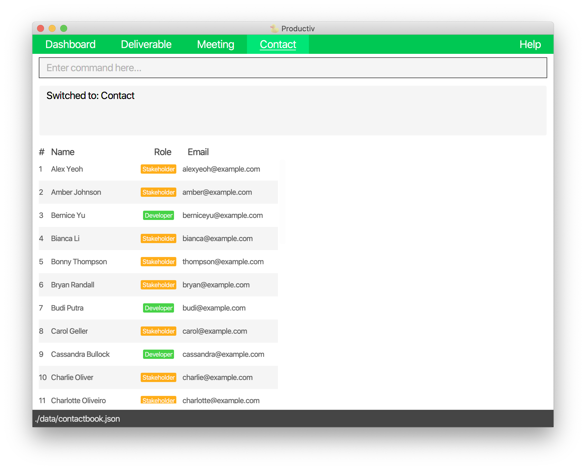
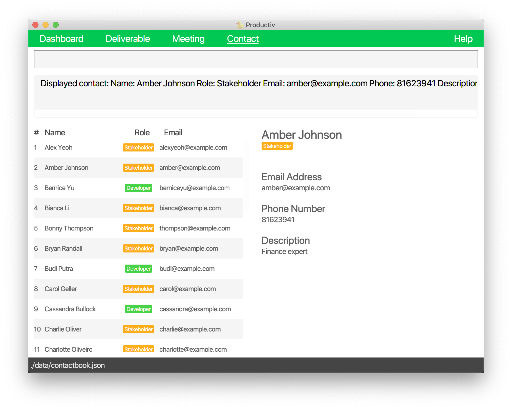

*Productiv* is a one-stop desktop app for product managers like yourself to organise your **deliverables**, 
**meetings** and **contacts** so that you can track your product's development easily.

*Productiv* is optimized for use via Command Line Interface (CLI). Thus, if you like to type and/or type fast, 
*Productiv* has just become better for you. Nevertheless, *Productiv* still has the benefits of a Graphical User Interface (GUI).

* Table of Contents
{:toc}

--------------------------------------------------------------------------------------------------------------------

## Quick start

1. Ensure you have Java `11` installed in your computer.

1. Download the latest `productiv.jar` from [here](https://github.com/AY2021S1-CS2103T-F11-2/tp/releases).

1. Copy the `.jar` file to your preferred folder.

1. Double-click the file to start *Productiv*. 
Your dashboard should appear in a few seconds. 
Note that the app contains some sample data. 

   
   <figcaption>Dashboard</figcaption> 
   
1. Type a command in the command box and press Enter to execute it. 
Here is a sequence of example commands you can try: 

   1. **`switch`** `dv` : Switches to deliverable mode.

   1. **`add`** `t/Find profile page template m/2.1.1 by/12-12-2020 12:00` : Adds a deliverable with the 
   title `Find profile page template`, milestone `2.1.1` and deadline `12-12-2020 12:00`.

   1. **`delete`** `1` : Deletes the 1st deliverable shown.

   1. **`exit`** : Exits the app.

1. Refer to [Features](#features) below for details of each available command.

--------------------------------------------------------------------------------------------------------------------

## Features

**:information_source: Notes about the command format:** 

* Words in upper case are the parameters to be supplied by you for their respective fields. 
  e.g. in `add n/NAME`, `NAME` is a parameter for the name field `n`, which can be used as `add n/Jason`. 
:bulb: **Tip:** If you are not sure what specific parameters to supply for any required fields, supply an estimate or random value as place holder.

* Field-parameter pairs in square brackets are optional. 
  e.g `n/NAME [p/PHONE]` can be used as `n/Jason p/98890112` or as `n/Jason`.

* Field-parameter pairs can be in any order. 
  e.g. if the command specifies `n/NAME e/EMAIL`, `e/EMAIL n/NAME` is also acceptable.
  
* If multiple and/or repeat parameters are provided for the same field, only the last parameter will be accepted. 
  e.g. if you input the command `r/dev n/NAME r/stk e/EMAIL r/stk` it will be accepted as `n/NAME r/stk e/EMAIL`.

### General

#### Switching modes: `switch`

Switches to dashboard, deliverable, meeting or contact mode.

Format: `switch MODE`
* `MODE` can be `db` (dashboard), `dv` (deliverable), `m` (meeting) or `c` (contact).
* `switch` `dv`, `m` or `c` will display your list of deliverables, meetings and contacts in the left panel respectively, 
e.g. `switch c` will display your list of contacts.
A view panel will be displayed in the right panel (initially empty).
* `switch db` will display your project's completion status in the left panel.
A schedule containing all your deliverables and meetings, chronologically sorted, will be displayed in the right panel.
* How the commands will be executed depend on which mode you are currently in, e.g. `delete 1` in meeting mode deletes the 1st meeting shown.

**:information_source: Note:** A warning message will be shown if you switch to the same mode that you are currently in.

Examples:
* `switch db` switches to dashboard mode.
* `switch m` switches to meeting mode.

#### Viewing help: `help`

Shows a message directing you to this User Guide.

Format: `help`
* Words after `help` will be ignored, e.g. `help I don't know what to do` will show the help message.

#### Exiting *Productiv*: `exit`

Exits the program.

Format: `exit`
* Words after `exit` will be ignored, e.g. `exit please` will exit *Productiv*.

#### Saving the data

*Productiv* automatically saves any changes that you made, to your computer's hard disk. 
Hence, you can focus on managing your product without fearing any unsaved changes.

### Deliverable

   
   <figcaption>Initial display of a deliverable list </figcaption>

#### Adding a deliverable: `add`

Adds a deliverable to your deliverable list.

Format: `add t/TITLE m/MILESTONE by/DEADLINE [d/DESCRIPTION] [c/CONTACTS]`
* `TITLE` is the main heading of the deliverable.
* `MILESTONE` is the milestone tagged to the deliverable.
* `MILESTONE` should only take in non-negative integers separated by periods, e.g. `1.3`, `14.2.1`.
* `DEADLINE` is the due date time of the deliverable in dd-MM-yyyy HH:mm format.
* `DEADLINE` can be in the past but must not be earlier than the year 2019.
* `DESCRIPTION` contains additional information about the deliverable, e.g. sub-requirements. 
* `CONTACTS` represents the contact(s) involved in seeing through the deliverable.
* `CONTACTS` is a comma-separated string of names.

**:information_source: Notes:** 

* `CONTACTS` has no relation to the contact(s) in your contact list. Hence, you are free to add those
who are not in your contact list.

* You cannot add a deliverable with the same `TITLE` and `DEADLINE` as an existing deliverable.

* All newly-added deliverables will be assigned the `on-going` tag regardless of their deadline. You will
need to manually mark past deliverables as `completed`. Refer to 
[Marking a deliverable as completed](#marking-a-deliverable-as-completed-done) below for more details on 
the `done` command.
  

Examples:
* `add t/Login screen m/1.1 by/10-10-2020 18:00 d/Include email and password fields c/Jordan Woods, Betsy Crowe` 
adds a deliverable with the title `Login screen`, milestone `1.1`,
deadline `10-10-2020 18:00`, description `Include email and password fields` and contacts `Jordan Woods, Betsy Crowe`.
* `add t/Find profile page template m/2.1.1 by/12-12-2020 12:00` 
adds a deliverable with the title `Find profile page template`, milestone `2.1.1` 
and deadline `12-12-2020 12:00`.

#### Editing a deliverable: `edit`

Edits an existing deliverable in your displayed deliverable list.

Format: `edit INDEX [t/TITLE] [m/MILESTONE] [by/DEADLINE] [d/DESCRIPTION] [c/CONTACTS]`
* `INDEX` is the index number of the deliverable in your displayed deliverable list.
* `INDEX` must be a positive integer.
* At least one of the fields of the deliverable must be changed.
* The existing values of the specified deliverable will be updated to the input values.

**:information_source: Note:** You cannot edit a deliverable to have the same `TITLE` and `DEADLINE` as an existing deliverable.
  

Examples:
*  `edit 1 d/Must include username, email and password fields by/13-12-2020 12:00`
edits the description of the 1st deliverable to be `Must include username, email and password fields`
and its deadline to be `13-12-2020 12:00`.
*  `edit 2 c/Jordan Woods, Betsy Crowe, Jeremey` edits the contacts of the 2nd deliverable to be `Jordan Woods, Betsy Crowe, Jeremey`.

#### Marking a deliverable as completed: `done`

Marks the specified deliverable from your displayed deliverable list as done.

Format: `done INDEX`
* `INDEX` is the index number of the deliverable in your displayed deliverable list.
* `INDEX` must be a positive integer.

Example:
* `done 1` marks the 1st deliverable in your displayed deliverable list as done.

#### Viewing a deliverable: `view`

Displays more details of the specified deliverable from your displayed deliverable list.

Format: `view INDEX`
* `INDEX` is the index number of the deliverable in your displayed deliverable list.
* `INDEX` must be a positive integer.

Example:
* `view 2` views the 2nd deliverable in your displayed deliverable list.

   
   <figcaption>Viewing a deliverable</figcaption> 

#### Finding deliverables: `find`

Finds the deliverables whose titles or descriptions contain any of the given keywords.

Format: `find KEYWORDS`
* `KEYWORDS` contains one or more keywords used to match deliverables.
* Searches only consider title and description.
* Searches are case-insensitive, e.g. `homepage` will match `Homepage`.
* Order of keywords does not matter, e.g. `Homepage Navigation` will match `Navigation Homepage`.
* Searches only account for full words, e.g. `Deploy` will not match `Deployment`.
* Searches return deliverables matching at least one keyword, e.g. `Homepage Navigation` will return `Complete Homepage` and `Increase size of Navigation Bar`.

Examples:
* `find Homepage urgent` returns a deliverable with title `Complete homepage` and another with description `Urgent, client is unhappy`.
* `find Mockup` returns a deliverable with name `Complete mockup` and another with description `Add more details to existing Mockup`.

#### Listing all deliverables: `list`

Displays a list of all deliverables in your deliverable list.

Format: `list`

:bulb:

**Tip:** Use this command when you want to list all your deliverables back after using the `find` command. 
Refer to [Finding deliverables](#finding-deliverables-find) above for details of the `find` command. 

#### Deleting a deliverable: `delete`

Deletes the specified deliverable from your deliverable list.

Format: `delete INDEX`
* `INDEX` is the index number of the deliverable in your displayed deliverable list.
* `INDEX` must be a positive integer.

Example:
* `delete 2` deletes the 2nd deliverable in your deliverable list.

#### Clearing all deliverables: `clear`

Clears all deliverables from the deliverable list.

Format: `clear`

### Meeting

   
   <figcaption>Initial display of a meeting list </figcaption>
 
#### Adding a meeting: `add`

Adds a meeting to your meeting list.

Format: `add t/TITLE from/FROM to/TO [d/DESCRIPTION] [c/CONTACTS] [l/LOCATION]`
* `TITLE` is the main heading of the meeting.
* `FROM` is the start date time of the meeting in dd-MM-yyyy HH:mm format.
* `FROM` can be in the past but must not be earlier than the year 2019.
* `TO` is the end time of the meeting in HH:mm format.
* `DESCRIPTION` contains additional details about the meeting, e.g. agenda.
* `CONTACTS` represents the contact(s) involved in the meeting. 
* `CONTACTS` is a comma-separated string of names.
* `LOCATION` is the location of the meeting.

**:information_source: Notes:** 

* Different meeting may have overlapping timings as you may wish to send a representative for your clashing meetings.

* `CONTACTS` has no relation to the contact(s) in your contact list. Hence, you are free to add those
who are not in your contact list.

* You cannot add a meeting with the same `TITLE`, `FROM` and `TO` as an existing meeting.
  

Example:
* `add t/Discuss app requirements from/12-12-2020 09:00 to/10:00 d/Refine with business associates c/Jordan Woods, Betsy Crowe`
adds a meeting with the title `Discuss app requirements`,
start date time `12-12-2020 09:00`, end time `10:00`, description `Refine with business associates` and contacts `Jordan Woods, Betsy Crowe`.
* `add t/User research review from/15-12-2020 13:00 to/15:00 l/Meeting room A` 
adds a meeting with the title `User research review`, start date time `15-12-2020 13:00`, 
end date time `15:00`, and location `Meeting room A`.

#### Editing a meeting: `edit`

Edits an existing meeting in your displayed meeting list.

Format: `edit INDEX [t/TITLE] [from/FROM] [to/TO] [d/DESCRIPTION] [c/CONTACTS] [l/LOCATION]`
* `INDEX` is the index number of the meeting in your displayed meeting list.
* `INDEX` must be a positive integer.
* At least one of the fields of the meeting must be changed.
* The existing values of the specified meeting will be updated to the input values.

**:information_source: Note:** You cannot edit a meeting to have the same `TITLE`, `FROM` and `TO` as an existing meeting.
  

Examples:
* `edit 2 t/Discuss final release features d/Finalize dashboard functions`
edits the title of the 2nd meeting to be `Discuss final release features` 
and its description to be `Finalize dashboard functions`.
* `edit 4 c/Jordan Woods, Betsy Crowe, Jeremey` edits the contacts of the 4th meeting to be `Jordan Woods, Betsy Crowe, Jeremey`.

#### Viewing a meeting: `view`

Displays more details of the specified meeting from your displayed meeting list.

Format: `view INDEX`
* `INDEX` is the index number of the meeting in your displayed meeting list.
* `INDEX` must be a positive integer.

Example:
* `view 2` views the 2nd meeting in your meeting list.

   
   <figcaption>Viewing a meeting</figcaption> 

#### Finding meetings: `find`

Finds the meetings whose titles or descriptions contain any of the given keywords.

Format: `find KEYWORDS`
* `KEYWORDS` contains one or more keywords used to match meetings.
* Searches only consider title and description.
* Searches are case-insensitive, e.g. `version` will match `Version`.
* Order of keywords does not matter, e.g. `v1.2 mid` will match `mid v1.2`.
* Searches only account for full words, e.g. `Meeting` will not match `Meetings`.
* Searches return meetings matching at least one keyword, e.g. `Complete game` will return `Complete features` and `Final game`.

Examples:
* `find discuss user guide John` returns a meeting with title `discuss user guide` and another with description `with Mr John`.
* `find Mcdonalds` returns a meeting with title `Meet Mcdonalds` and another with description `Cater Mcdonalds breakfast`.

#### Listing all meetings: `list`

Displays a list of all meetings in your meeting list.

Format: `list`

:bulb:

**Tip:** Use this command when you want to list all your meetings back after using the `find` command. 
Refer to [Finding meetings](#finding-meetings-find) above for details of the `find` command. 

#### Deleting a meeting: `delete`

Deletes the specified meeting from your displayed meeting list.

Format: `delete INDEX`
* `INDEX` is the index number of the meeting in your displayed meeting list.
* `INDEX` must be a positive integer.

Example:
* `delete 3` deletes the 3rd meeting in your displayed meeting list.

#### Clearing all meetings: `clear`

Clears all meetings from your meeting list.

Format: `clear` 

### Contact

   
   <figcaption>Initial display of a contact list </figcaption>

#### Adding a contact: `add`

Adds a developer or stakeholder to your contact list.

Format: `add r/ROLE n/NAME e/EMAIL [p/PHONE] [d/DESCRIPTION]`
* `ROLE` is the type of contact, either `dev` (developer) or `stk` (stakeholder).
* `NAME` is the name of the contact.
* `EMAIL` is the email address of the contact.
* `PHONE` is the phone number of the contact.
* `PHONE` should only contain numbers, and must be at least 3-digits long.
* `DESCRIPTION` contains additional information about the contact, such as their job position.

**:information_source: Note:** You cannot add a contact with the same `NAME` and `EMAIL` as an existing contact.
  

:bulb:

**Tip:** Leave out the + sign for `PHONE`s with country codes.

Examples:
* `add r/dev n/Jordan Woods e/jordanwoods@glutter.com p/81234567`
adds a developer with the name `Jordan Woods`, email `jordanwoods@glutter.com` and phone number `81234567`.
* `add r/stk n/Betsy Crowe e/betsybet872@pmail.com`
adds a stakeholder with the name `Betsy Crowe` and email `betsybet872@pmail.com`.

#### Editing a contact: `edit`

Edits an existing contact in your displayed contact list.

Format: `edit INDEX [n/NAME] [e/EMAIL] [p/PHONE_NUMBER] [d/DESCRIPTION]`
* `INDEX` is the index number of the contact in your displayed contact list.
* `INDEX` must be a positive integer.
* At least one of the fields of the contact must be changed.
* The existing values of the specified contact will be updated to the input values.

**:information_source: Note:** You cannot edit a contact to have the same `NAME` and `EMAIL` as an existing contact.
  

Examples:
*  `edit 1 e/jeremysand@glutter.com p/81234567`
edits the email and phone number of the 1st contact to be `jeremysand@glutter.com` and `81234567` respectively.
*  `edit 2 n/Jayden Smith` 
edits the name of the 2nd contact to be `Jayden Smith`.

#### Viewing a contact: `view`

Displays more details of the specified contact from your displayed contact list.

Format: `view INDEX`
* `INDEX` is the index number of the contact in your displayed contact list.
* `INDEX` must be a positive integer.

Example:
* `view 2` views the 2nd contact in your contact list.

   
   <figcaption>Viewing a contact</figcaption> 

#### Finding contacts: `find`

Finds the contacts whose names or descriptions contain any of the given keywords.

Format: `find KEYWORDS`
* `KEYWORDS` contains one or more keywords used to match contacts.
* Searches only consider name and description.
* Searches are case-insensitive, e.g. `hans` will match `Hans`.
* Order of keywords does not matter, e.g. `Hans Bo` will match `Bo Hans`.
* Searches only account for full words, e.g. `Han` will not match `Hans`.
* Searches return contacts matching at least one keyword, e.g. `Hans Bo` will return `Hans Seed` and `Bo Yarns`.

Examples:
* `find John Kite` returns a contact with name `john kite` and another with description `Kite manufacturer`.
* `find Sun` returns a contact with name `Joe Sun` and another with description `Works at Sun Tools`.

#### Listing all contacts: `list`

Displays a list of all contacts in your contact list.

Format: `list`

:bulb:

**Tip:** Use this command when you want to list all your contacts back after using the `find` command. 
Refer to [Finding contacts](#finding-contacts-find) above for details of the `find` command. 

#### Deleting a contact: `delete`

Deletes the specified contact from your displayed contact list.

Format: `delete INDEX`
* `INDEX` is the index number of the contact in your displayed contact list.
* `INDEX` must be a positive integer.

Example:
* `delete 3` deletes the 3rd contact in the displayed contact list.

#### Clearing all contacts: `clear`

Clears all contacts from your contact list.

Format: `clear`

--------------------------------------------------------------------------------------------------------------------

## FAQ

**Q**: How do I start using *Productiv*? 
**A**: You can refer to our [Quick Start Guide](#quick-start).

**Q**: Which operating systems can I run *Productiv* on? 
**A**: Currently, *Productiv* is supported on both Mac and Windows. Just ensure 
that you have Java `11` or above installed on your computer.

**Q**: How do I transfer my data to another Computer? 
**A**: Install the app in the other computer and overwrite the empty data file it 
creates with the file that contains the data of your previous *Productiv* app.

---------------------------------------------------------------------------------------------------------------------

## Command summary

### General 

Action         | Format, Examples
-------------- |--------------------------------------------------------------------------------------------------
**Switch**     | `switch MODE`   e.g. `switch dv`
**Help**       | `help`
**Exit**       | `exit`

### Deliverable

Action         | Format, Examples
---------------|------------------------
Add            | `add t/TITLE m/MILESTONE by/DEADLINE [d/DESCRIPTION] [c/CONTACTS]`   e.g. `add t/Login screen m/1.1 by/10-10-2020 18:00 d/Include email and password fields c/Jordan Woods, Betsy Crowe` 
Edit           | `edit INDEX [t/TITLE] [m/MILESTONE] [by/DEADLINE] [d/DESCRIPTION] [c/CONTACTS]`   e.g. `edit 1 d/Must include username, email and password fields by/13-12-2020 12:00`
Mark as Done   | `done INDEX`   e.g. `done 3`
View           | `view INDEX`   e.g. `view 2`
Find           | `find KEYWORDS`   e.g. `find Homepage urgent`
List           | `list` 
Delete         | `delete INDEX`   e.g. `delete 3`
Clear          | `clear`

### Meeting

Action         | Format, Examples
---------------|------------------------
Add            | `add t/TITLE from/FROM to/TO [d/DESCRIPTION] [c/CONTACTS] [l/LOCATION]`   e.g. `add t/Discuss app requirements from/12-12-2020 09:00 to/10:00 d/Refine with business associates c/Jordan Woods, Betsy Crowe`
Edit           | `edit INDEX [t/TITLE] [from/FROM] [to/TO] [d/DESCRIPTION] [c/CONTACTS] [l/LOCATION]`   e.g. `edit 2 t/Discuss final release features d/Finalize dashboard functions`
View           | `view INDEX`   e.g. `view 2`
Find           | `find KEYWORDS`   e.g. `find discuss user guide John`
List           | `list` 
Delete         | `delete INDEX`   e.g. `delete 3`
Clear          | `clear`

### Contact

Action         | Format, Examples
---------------|------------------------
Add            | `add r/ROLE n/NAME e/EMAIL [p/PHONE] [d/DESCRIPTION]`   e.g. `add r/stk n/Johnny e/johnny@example.com p/12345678`
Edit           | `edit INDEX [n/NAME] [e/EMAIL] [p/PHONE_NUMBER] [d/DESCRIPTION]` `edit 1 r/dev n/John e/john@email.com`
View           | `view INDEX`   e.g. `view 2`
Find           | `find KEYWORDS`   e.g. `find John Kite`
List           | `list` 
Delete         | `delete INDEX`   e.g. `delete 3`
Clear          | `clear`

---------------------------------------------------------------------------------------------------------------------

## Glossary

\# |            Term                | Description
---|--------------------------------|------------------------------------------------------------------------------------------------|
1  | Command Line Interface (CLI)   | A text-based user interface (UI) used to view and manage computer files.                       |
2  | Graphical User Interface (GUI) | A system of interactive visual components for computer software.                               |
3  | Deliverable                    | An item which needs to be completed by a specified time.                                       |
4  | Stakeholder                    | An external party involved with the product.                                                   |
5  | Milestone                      | A stage in the software development process associated with a particular group of deliverables |
